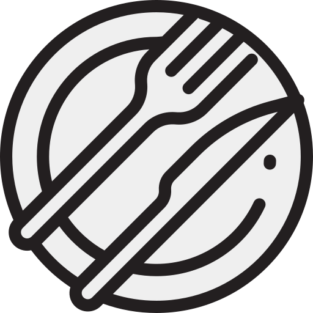
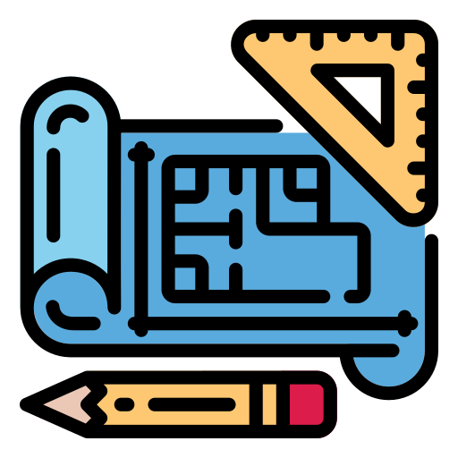
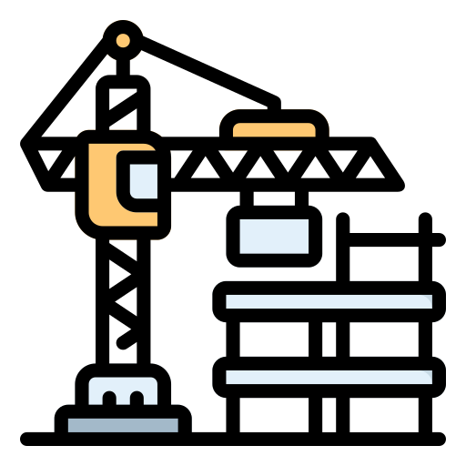

#  quai-antique

 Restaurant le quai antique:

 Le Back-end du projet repose sur une API Symfony qui permet la gestion et le stockage en base de donnée des utilisateurs, des réservations.
Il permet aussi a l’administrateur de modifier la carte, les menus ainsi qu'une galerie photo du restaurant.

 La partie front-end s’appuie sur le Framework React. qui communique avec l’API affin d’accueillir les client sur une interphase fluide et moderne.

------------
 En Cour de production 

le site sera mise en ligne avec plus detail une foit le developpement fini, n'hésitez pas a revenir!! Merci